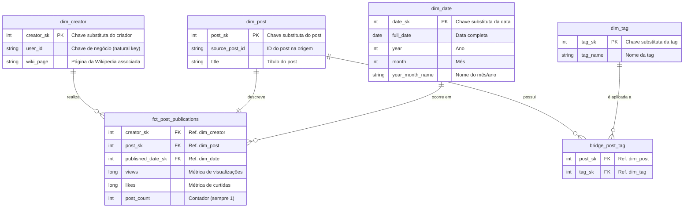

----

### **Proposta de Arquitetura: Plataforma de Dados para Inteligência de Conteúdo**

#### **Resumo Executivo e Visão Estratégica**

Este documento descreve a arquitetura de uma plataforma de dados  projetada para transformar dados brutos de criadores de conteúdo em um ativo estratégico para a Winnin. A solução, baseada na arquitetura Lakehouse Medallion, busca estabelecer um fundamento governado, com ótimo custo-benefício e com potencial de evolução para iniciativas de IA e BI. O foco estratégico reside em diminuir riscos de dependência tecnológica, garantir a confiabilidade dos dados através de contratos (SLAs/SLOs) e gerenciar os custos operacionais (CLOs).

#### **Princípios de Design**

Toda a arquitetura e o ciclo de vida de desenvolvimento desta plataforma são governados pelos seguintes princípios fundamentais:

- **Arquitetura Agnóstica e Flexível**: As escolhas tecnológicas, especialmente para componentes como o orquestrador, devem priorizar a flexibilidade de longo prazo e mitigar o risco de dependência de um único fornecedor (`vendor lock-in`).
- **Governança Ativa por Design**: Qualidade, segurança e metadados não são etapas finais, mas características intrínsecas ao design. Cada componente é construído com base em contratos de dados e validações automáticas.
- **Eficiência de Custo como Métrica (FinOps)**: O custo não é um resultado, mas uma métrica de primeira classe a ser gerenciada. A arquitetura incorpora CLOs (Cost Level Objectives) e mecanismos de controle proativo.
- **Operabilidade e Automação (Runbooks)**: A plataforma é projetada para ser operada de forma previsível e com baixa carga cognitiva. Para cada processo de rotina (como um backfill) e para cada alerta de monitoramento acionável, a criação de um **Runbook Operacional** claro e detalhado é um critério de aceite obrigatório do projeto.

#### **1. Orquestrador**

A escolha do orquestrador é uma decisão que impacta a flexibilidade e a manutenibilidade da plataforma a longo prazo.

  * **Recomendação Principal: Apache Airflow**

      * **Justificativa Estratégica**: A principal vantagem do Airflow é ser **agnóstico à plataforma de execução**. Assim, a lógica de negócio e as dependências do pipeline (as DAGs) permanecem desacopladas da infraestrutura abaixo (Databricks). Isso garante que uma migração de plataforma seja de menor impacto, alterando-se apenas os operadores de tarefas.

  * **Alternativa Tática: Databricks Workflows**

      * **Justificativa Tática**: Caso a estratégia de longo prazo seja consolidar a operação exclusivamente no ecossistema Databricks. Nesse caso o Workflows se torna uma escolha de menor atrito operacional. Sua integração nativa com o Unity Catalog, Notebooks e Repos simplifica o desenvolvimento e manutenção.


#### **2. Modelagem de Dados: Da Integridade à Performance**

A solução escolhida é a arquitetura **Lakehouse Medallion**, que organiza os dados em camadas de qualidade crescente (Bronze, Silver, Gold), garantindo rastreabilidade e múltiplos pontos de uso. A filosofia de modelagem evolui em cada camada para servir a propósitos diferentes:

- **Filosofia da camada Silver**: A prioridade é criar tabelas limpas, tipadas e prontas para o `JOIN` da análise. O modelo aceita um grau de desnormalização (como `views`, `likes` e `tags` na mesma tabela de posts) para simplificar a ingestão e o uso imediato. As chaves naturais e de negócio (`user_id`, `yt_user`) são usadas para conectar as entidades.
    
- **Filosofia da camada Gold**: O foco da camada Gold é a **performance e a simplicidade de consulta** para BI e Análise. Transformamos o modelo da Silver em um **esquema estrela (Star Schema)**, que é otimizado para ferramentas de visualização. Para isso, utilizamos **chaves substitutas (Surrogate Keys)** numéricas, que aceleram `JOINs` e são essenciais para o rastreamento de histórico (Slowly Changing Dimensions).
    
- **Contextualização do Modelo**: O modelo dimensional proposto usa como base as análises exploradas no notebook `4 - analyze_creators.py`. Ele estrutura os dados de forma que as perguntas de negócio (Top 3 posts, publicações por mês, etc.) possam ser respondidas de maneira eficiente e escalável, servindo como a base para dashboards e relatórios.


##### **Visão Arquitetural (Diagramas)**
 
O **Diagrama de Fluxo** abaixo ilustra a jornada dos dados através das camadas Medallion, desde as fontes externas até os consumidores finais.


### Mapa de Nomes (Dev ↔ Prod)

Durante o desafio (dev), as tabelas foram materializadas no schema `default`. Em produção, adotamos o Medallion com Unity Catalog.

| Ambiente | Tabela (dev)                     | Tabela (prod)                    | Observação                    |
|----------|----------------------------------|----------------------------------|-------------------------------|
| Dev      | `default.creators_scrape_wiki`   | `bronze.creators_scrape_wiki`    | Raw imutável (ingestion_date) |
| Dev      | `default.posts_creator`          | `silver.posts_creator`           | Limpa, tipada e particionada  |
| Dev      | `default.users_yt`               | `silver.users_yt`                | Dimensional canônica          |
| Dev      | `default.users_yt_errors`        | `silver.users_yt_errors`         | Quarentena/erros de extração  |


##### **Documentação Detalhada - Camada Silver**

- **Tabelas Principais**:
    
    - `silver.users_yt`: Tabela dimensional de criadores, servindo como o mapeamento canônico entre `wiki_page` e o `user_id` do YouTube.
    - `silver.posts_creator`: Tabela principal contendo os dados dos posts. De forma denormalizada, ela inclui metadados do vídeo (título, data), métricas de engajamento (views, likes) e atributos adicionais (tags).
        
- **Tabelas de Quarentena**:
    - `silver.users_yt_errors`: Armazena as `wiki_page` que falharam no processo de scraping da API da Wikipedia, garantindo transparência e permitindo o reprocesso.
        
- **Relacionamento e Chaves**:

(A tabela de relacionamento foca nas entidades de negócio principais, enquanto a tabela de erros é um log operacional)

| Tabela              | Chave Primária (PK) | Chaves Estrangeiras (FK) | Relacionamento Principal                                  |
| ------------------- | ------------------- | ------------------------ | --------------------------------------------------------- |
| **`users_yt`**      | `user_id`           | -                        | Entidade principal dos criadores.                         |
| **`posts_creator`** | (Chave Composta)¹   | `yt_user`                | **1 criador → N posts**. Contém todos os dados dos posts. |


¹A tabela `posts_creator` não possui uma chave primária simples. Conforme a lógica de deduplicação no notebook `2`, a unicidade de um post é garantida pela combinação de (`creator_id`, `title`, `published_at_ts`).


**Diagrama Entidade-Relacionamento (ER)** da estrutura normalizada da camada Silver:


###### **Dicionário de dados da camada Silver**

- **`silver.users_yt`**
    - `user_id` (PK, natural): Identificador do canal/usuário no YouTube, chave para joins.
    - `wiki_page` (UK): Nome da página na Wikipedia de onde o `user_id` foi extraído.
        
- **`silver.posts_creator`**
    - `creator_id`: ID original do post vindo do arquivo fonte.
    - `yt_user` (FK → users_yt): Identificador do canal associado ao post.
    - `title`: Título do vídeo.
    - `views`, `likes`: Métricas de engajamento do post.
    - `tags`: Lista (Array) de tags associadas ao vídeo.
    - `published_at_ts`: Timestamp normalizado da data de publicação.
    - `published_month`: Data truncada para o primeiro dia do mês da publicação, usada para agregações.

- **`silver.users_yt_errors`**
	- `wiki_page`: Nome da página na Wikipedia que foi processada sem sucesso.
	- `error`: Motivo da falha (ex: 'user_id_not_found', 'empty_page').

##### Padronização Temporal (UTC)

Todas as datas/horários são **normalizados em UTC** já na camada Silver. Isso garante janelas analíticas consistentes entre cargas, fusos e horário de verão. A camada Gold utiliza uma `dim_date` derivada de UTC; o `date_sk` também é derivado de UTC para padronização entre fatos e dimensões.


##### **Documentação Detalhada - Camada Gold**

**Tabelas Principais**: O modelo é composto por uma tabela fato central, `fct_post_publications`, que registra o evento de uma publicação, e é cercada por dimensões que descrevem o contexto desse evento.


**Dimensões (Descrevem "quem", "o quê", "quando" e "como")**

| Tabela            | Chave Primária (PK) | Chaves de Negócio (Rastreabilidade) | Descrição                                          |
| ----------------- | ------------------- | ----------------------------------- | -------------------------------------------------- |
| **`dim_creator`** | `creator_sk`        | `user_id`                           | Armazena os atributos de cada criador de conteúdo. |
| **`dim_post`**    | `post_sk`           | `creator_id` (do arquivo)           | Armazena os metadados de cada post (título, etc.). |
| **`dim_date`**    | `date_sk`           | `full_date`                         | Dimensão de calendário para análises temporais.    |
| **`dim_tag`**     | `tag_sk`            | `tag_name`                          | Armazena cada tag única encontrada nos posts.      |


**Tabelas Fato e Ponte (Medem os "quantos")**

| Tabela                      | Granularidade                                          | Chaves Estrangeiras (FK)                     | Medidas (Fatos)                           |
| --------------------------- | ------------------------------------------------------ | -------------------------------------------- | ----------------------------------------- |
| **`fct_post_publications`** | Uma linha por post publicado                           | `creator_sk`, `post_sk`, `published_date_sk` | `views`, `likes`, `post_count` (sempre 1) |
| **`bridge_post_tag`         | Existe no máximo 1 linha por par (`post_sk`, `tag_sk`) | `post_sk`, `tag_sk`                          | (Nenhuma medida)                          |


**Diagrama Entidade-Relacionamento (ER)** da camada Gold:




###### **Dicionário de dados da Camada Gold**

- **`dim_creator`** (`creator_sk` PK, `user_id` NK, `wiki_page`)
    - `creator_sk`: Chave substituta única para cada criador.
    - `user_id`: Chave de negócio (natural key) vinda da `silver.users_yt`.
    - `wiki_page`: Página da Wikipedia associada.
        
- **`dim_post`** (`post_sk` PK, `source_post_id` NK, `title`)
    - `post_sk`: Chave substituta única para cada post.
    - `source_post_id`: Chave de negócio (`creator_id` do arquivo original).
    - `title`: Título do post.
        
- **`dim_date`** (`date_sk` PK, `full_date`, `year`, `month`, `year_month_name`, `dow`, `is_weekend`, `iso_year`, `iso_week`, `tz`)
	- `date_sk`: **inteiro derivado de UTC no formato `YYYYMMDD`** (ex.: 20240415).
	- `full_date`: **DATE (UTC)** correspondente ao `date_sk`.
	- `year`, `month`: Componentes numéricos da data.
	- `year_month_name`: Formato para exibição (ex.: `2024-Abril`).
	- `dow`: Dia da semana **1–7 (ISO 8601, 1=segunda, 7=domingo)**.
	- `is_weekend`: Indicador de fim de semana (**TRUE** se `dow` ∈ {6,7}).
	- `iso_year`, `iso_week`: Ano/Semana ISO (atenção a semanas que “viram” de ano).
	- `tz`: Fuso de referência (**sempre `UTC` na base**; fusos locais podem ser tratados em views).
	        
- **`dim_tag`** (`tag_sk` PK, `tag_name`)
    - `tag_sk`: Chave substituta única para cada tag.
    - `tag_name`: O texto da tag.
        
- **`fct_post_publications`** (`creator_sk` FK, `post_sk` FK, `published_date_sk` FK, `views`, `likes`, `post_count`)
    
    - `creator_sk`, `post_sk`, `published_date_sk`: Chaves estrangeiras que conectam às dimensões.
    - `views`, `likes`: Métricas de engajamento do post.
    - `post_count`: Medida aditiva (sempre 1) para facilitar a contagem de posts.
        
- **`bridge_post_tag`** (`post_sk` FK, `tag_sk` FK)
    - `post_sk`, `tag_sk`: Chaves estrangeiras que resolvem a relação N:M entre posts e tags.


#### **3. Extração de Dados - extração inicial e atualizações**

A extração visa ser resiliente e eficiente, lidando com as características de cada fonte de dados.

  * **Fonte 1: Wikipedia API (para descoberta de canais)**

      * **Estratégia**: A extração é um processo de tentativas em funil:
        1.  **Tentativa 1 (Links Externos)**: Utiliza o endpoint `action=parse&prop=externallinks` para buscar URLs conhecidas do YouTube.
        2.  **Tentativa 2 (Busca Interna)**: Caso a primeira falhe, utiliza a API de busca (`action=query&list=search`) como alternativa.
      * **Práticas de Robustez**: A interação com a API inclui `User-Agent` identificável, `retries` com backoff exponencial e uma **Quarentena de Falhas (Dead-Letter Queue)** para registros que não puderam ser resolvidos, transformando falhas de extração em um processo de melhoria contínua.

  * **Fonte 2: YouTube Data API v3 (dados de canais e vídeos)**

      * **Extração Inicial (Backfill)**: Realizada sob demanda. Carga histórica é dividida em intervalos de tempo menores (ex: por mês) para evitar exceder as cotas da API.
      * **Atualizações (Incremental)**:
          * **Novos Vídeos**: Uma tarefa incremental busca vídeos publicados nas últimas 24-48 horas, utilizando um **checkpoint (watermark)** para cada canal, garantindo que nenhum dado seja perdido.
          * **Métricas de Engajamento**: Uma tarefa diária separada consulta as estatísticas de vídeos ativos para capturar a evolução de views, likes, etc.
      * **Gerenciamento de Cotas**: As chamadas são otimizadas para solicitar múltiplos `parts` (ex: `snippet`, `statistics`) de uma vez, minimizando o consumo de cota.
      * **Discovery (canônico)**: Resolver para o `user_id` **canônico no contexto deste projeto** (derivado da Wikipedia/YouTube). Mudanças de `@handle`/URL podem ocorrer; o pipeline mitiga isso com **reverificação por TTL** e amostragem diária (re-hidratação de `users_yt`).

##### **Incremental & Idempotência (operacional)**

- **Watermark por canal**: Armazenar `max(published_at_ts)` por `yt_user` (da tabela `posts_creator`); nas execuções, consultar `publishedAfter = watermark - overlap(24–48h)` para tolerância a falhas.
- **Idempotência em Silver**: Consolidar Bronze→Silver com `MERGE` na tabela `silver.posts_creator` usando a chave de negócio que define um post de forma única: a combinação de **`creator_id`** (ID do post na origem), **`title`** e **`published_at_ts`**. Reprocessar janelas históricas não duplicará os dados.
- **Particionamento**: A camada Bronze é particionada por `ingestion_date`; **Em produção**, a `silver.posts_creator` é **particionada por `published_month`** e otimizada com `OPTIMIZE`/`ZORDER (yt_user, published_month)`.


#### **4. Etapas do Pipeline: o fluxo de dados**

O fluxo de dados é orquestrado como um Grafo Acíclico Dirigido (DAG), garantindo que as tarefas sejam executadas na ordem correta e de forma idempotente.

1. **Tarefa 1: Descoberta e Enriquecimento de Criadores (Diário)**: Atualiza a tabela `silver.users_yt` a partir da API da Wikipedia. Em caso de falha, popula a tabela de quarentena `silver.users_yt_errors`.
2. **Tarefa 2: Ingestão Incremental de Posts e Métricas (execução horária):** Captura novos posts de canais ativos, incluindo metadados, métricas (`views`, `likes`) e tags, e atualiza a tabela denormalizada `silver.posts_creator`.
3. **Tarefa 3: Construção da Camada Gold (Diário)**: Após a atualização da Silver, esta tarefa executa as agregações que materializam o Data Mart analítico nas tabelas `dim_*` e `fct_*`, prontas para consumo.
4. **Tarefa 4: Cargas Históricas (Sob Demanda)**: Workflows parametrizados para realizar o _backfill_ de dados de posts de novos criadores, populando a tabela `silver.posts_creator`.

 **Nota de execução**: Todos os jobs definem `spark.sql.session.timeZone = 'UTC'` antes de qualquer leitura/escrita, garantindo normalização temporal ponta-a-ponta.

##### **Roteiro de Implantação e Manutenção**

1. **Seed inicial** de `wiki_page` (via CSV ou inserção manual).
2. Executar o job **Enrich Wiki** para realizar a primeira carga das tabelas `silver.users_yt` e `silver.users_yt_errors`.
3. Executar o job **Backfill Vídeos** (por mês ou ano) para carregar o histórico de posts na tabela `silver.posts_creator`.
4. **Agendar** o job de **Incremental Vídeos** (execução horária) para manter a `silver.posts_creator` atualizada.
5. **Agendar** o job de **Build Gold** para ser executado diariamente, com dependência na conclusão das tarefas incrementais.
6. **Monitorar** continuamente os dashboards de SLIs/SLOs/SLA e custos; revisar periodicamente a tabela `silver.users_yt_errors` para identificar e corrigir problemas de scraping.

##### **Exemplo de Runbook Operacional: Backfill para um Novo Criador**

- **Objetivo**: Realizar a carga histórica de todos os posts de um novo criador que foi recentemente adicionado ao sistema.
- **Gatilho**: Solicitação do time de Análise ou adição de um novo `user_id` de alta prioridade.
    
- **Pré-requisitos**:
    - O `wiki_page` do novo criador já deve existir na tabela `bronze.creators_scrape_wiki`.
    - O job `Enrich Wiki` já deve ter sido executado com sucesso para este criador, gerando um registro em `silver.users_yt`.
        
- **Passos de Execução**:
    1. Navegue até o orquestrador (Airflow/Databricks Workflows).
    2. Localize o workflow/job `[Backfill Vídeos]`.
    3. Execute o job manualmente com os seguintes parâmetros:
        - `user_id`: `"{ID_DO_CRIADOR}"`
        - `start_date`: `"2015-01-01"` (ou a data de início desejada)
        - `end_date`: `"{DATA_ATUAL}"`
    4. Acompanhe a execução do job no log do orquestrador.

- **Passos de Validação**:
    1. Após a conclusão do job, execute a seguinte query no Databricks para confirmar que os posts foram carregados:
        ```
        SELECT COUNT(*), MIN(published_month), MAX(published_month) 
        FROM silver.posts_creator 
        WHERE yt_user = '{ID_DO_CRIADOR}';
        ```
    2. Verifique se a contagem é maior que zero e se as datas mínima e máxima são consistentes com o histórico do canal.

- **Ações de Rollback**:
    - Se o job falhar, nenhuma ação é necessária, pois a operação de `MERGE` garante que dados parciais não gerem duplicatas em uma re-execução. Apenas execute o job novamente.


#### **5. Monitoramento, Qualidade e Governança**

A estratégia de monitoramento é ligada à uma **biblioteca de Runbooks Operacionais**: cada alerta acionável gerado pelo sistema deve corresponder a um runbook documentado, garantindo uma resposta a incidentes rápida, padronizada e com baixa margem de erro. As metas são definidas de forma explícita e mensurável, formando um contrato claro sobre a performance e confiabilidade da plataforma.

  - **SLA (Service Level Agreement - Compromisso de Entrega)**:

      - **Disponibilidade**: A camada Gold estará pronta para consumo até as **02:00 UTC (D+0), 7 dias por semana**.
      - **Reprocesso**: A reexecução completa de uma janela de dados (mensal ou por canal) será concluída em **até 2 horas** após o acionamento.

  - **SLO (Service Level Objective - Objetivos de Qualidade Interna)**:

      - **Frescor**: Em ≥ 99% dos dias, o atraso dos dados na Gold será **inferior a 2 horas** em relação ao fechamento de D-1.
      - **Completude**: ≥ 98% dos criadores de conteúdo ativos (em `silver.posts_creator`) terão um registro correspondente em `silver.users_yt`.
      - **Unicidade**: 100% de unicidade para a chave de negócio de posts (combinação de `creator_id`, `title`, `published_at_ts`) na tabela `silver.posts_creator`.
      - **Sucesso e Confiabilidade**: ≥ 99% das execuções diárias do pipeline serão concluídas sem falhas (excluindo retries automáticos), resultando em uma **taxa de falha mensal inferior a 1%**.

  - **CLO (Cost Level Objective - Objetivos de Custo)**:

      - **Metas de Custo**: O custo operacional se manterá abaixo dos seguintes limites: **≤ $X por dia**, **≤ $Y por 1.000 vídeos processados, ou ≤ $Z por canal ativo/mês**.
      - **Critério de Sucesso**: As metas de CLO serão atingidas em **≥ 95% dos dias**, com alertas automáticos para qualquer projeção de estouro do orçamento.

-  Notas de mensuração: exemplos de como serão medidos

	- **Frescor (Gold < 2h D-1)**: medido por `max(load_end_ts)` das tabelas `dim_*`/`fct_*` vs. `cutoff D-1 23:59:59 UTC`.
	- **Completude (≥ 98%)**: `COUNT(DISTINCT yt_user em posts_creator)` cobertos por `users_yt`.
	- **CLO (≤ $X/$Y/$Z)**: coletado via **export de billing** + **tags de custo por job**; apuração diária e alerta preditivo (projeção semanal).
	-
##### **Qualidade dos Dados (Governança Ativa)**:

A qualidade é garantida por **Contratos de Dados** automatizados, aplicados através de uma **pirâmide de testes**:

##### Data Quality — Regras & Ações

- **Críticas (FAIL)**
    - `wiki_page` **única** em `silver.users_yt`.
    - `published_at_ts` **NOT NULL** em `silver.posts_creator`.
    - Unicidade da **chave de negócio composta** de `posts_creator`.
    - Sem duplicidade em `gold.bridge_post_tag`** para o par (`post_sk`, `tag_sk`).
    
- **Importantes (WARN)**
    - `user_id` duplicado em `users_yt` (**sinaliza consolidação**).
    - `views ≥ 0`, `likes ≥ 0`.

*Exemplos (Delta Constraints):*

```sql
ALTER TABLE silver.posts_creator
  ADD CONSTRAINT nn_published CHECK (published_at_ts IS NOT NULL);
-- Nota: a unicidade da chave de negócio de posts_creator deve ser garantida no pipeline
-- via MERGE e deduplicação, pois constraints de unicidade composta não são forçados ativamente pelo databricks a cada escrita.
```


#### **6. Boas Práticas 


Para garantir que a plataforma de dados seja robusta, manutenível e escalável, adotamos um conjunto de boas práticas estruturais. Se trata de um ciclo de vida dos dados integrado que abrange desde o desenvolvimento até a governança e a gestão de custos.

O **Ciclo de Vida de Desenvolvimento** é projetado para garantir qualidade e velocidade. O branching model para o git segue o fluxo de um **Gitflow enxuto** (`main`, `develop`, `feature/*`), com branches main e develop protegidas. Também toda alteração é validada por meio de Pull Requests e code review. Cada PR dispara um pipeline de **CI/CD no GitHub Actions** que atua como um portão de qualidade automatizado, executando uma suíte completa de validações: desde *linting* (Ruff), formatação (Black) e checagem de tipos (Mypy), até testes unitários com PySpark, testes de contrato que verificam schemas e testes de dados que garantiam a integridade do negócio. Apenas após a aprovação em todos os estágios, o código é integrado, seguindo os princípios de *Conventional Commits* e *Semantic Versioning* para manter um histórico de mudanças claro e previsível.

A infraestrutura deve ser tão confiável e versionada quanto o código. Por isso, é praticada a **Infraestrutura como Código (IaC)** de forma rigorosa. Jobs, clusters, permissões e políticas são definidos em código utilizando **Terraform**. Isso automatiza o deploy, garante a consistência entre ambientes e, além de tudo, permite uma Gestão de Custos otimizada. Os  **CLOs (Cost Level Objectives)** são implementados através de políticas de cluster que forçam o uso de `auto-termination` e autoscaling conservador, além de otimizações contínuas de Spark, como particionamento, `OPTIMIZE` e `Z-ORDER` seletivo, sempre com alertas de orçamento para evitar surpresas.

A **Segurança e a Governança Ativa** são pilares integrados ao fluxo de trabalho, habilitados pelo **Unity Catalog**. A segurança começa no código, com a gestão de segredos via Databricks Secrets/KMS e varreduras automáticas de dependências (Dependabot). No nível dos dados, o Unity Catalog permite a implementação de **RBAC por camada** (escrita restrita em Bronze/Silver, leitura ampla em Gold) e fornece uma **linhagem de dados** completa para auditoria. A governança se torna "viva" e operacionalizável ao documentarmos nossas tabelas no código, como um contrato explícito com os consumidores:

```sql
-- Exemplo de documentação e política de governança
COMMENT ON TABLE silver.posts_creator IS 'Tabela denormalizada de posts, incluindo metadados e métricas. Fonte da verdade para posts.';

ALTER TABLE silver.posts_creator SET TBLPROPERTIES (
  'owner'='data-engineering',
  'slo.freshness.target'='2h',
  'data.classification'='public'
);

-- Aplica política de retenção de dados para conformidade e otimização de custos
VACUUM silver.posts_creator RETAIN 240 HOURS; -- Retém 10 dias de histórico
```

Ao combinar essas práticas, é criado um ciclo onde código de alta qualidade gera uma infraestrutura confiável, que por sua vez executa pipelines seguros, governados e com custo otimizado, entregando valor de forma consistente e escalável.


#### 7. Entrega / Repositório

Estrutura do repositório:

```md
├── notebooks/  
│ ├── 1_create_table_creators_scrape_wiki.py  
│ ├── 2_create_table_posts_creator.py  
│ ├── 3_create_table_user_yt_from_wikipedia_api.py  
│ └── 4_analyze_creators.py  
├── src/  
│ ├── extract/ # clients Wikipedia/YouTube (retry/backoff)  
│ ├── transform/ # normalizações, dedup, calendários  
│ ├── quality/ # expectations/checks  
│ └── utils/ # io, configs, logging  
├── tests/  
│ ├── unit/ # regex, parsing, utils  
│ ├── contract/ # schemas  
│ └── integration/ # transforms (Spark local)  
├── jobs/ # JSON/YAML de Workflows/Jobs (IaC)  
├── docs/  
│ ├── architecture.md # este documento + diagrama mermaid  
│ ├── data-dictionary.md  
│ └── slis_slos_slas_clos.md  
└── README.md
```
